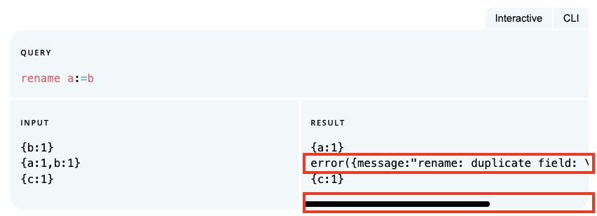

# SuperDB docs

This directory contains the user documentation for all of the SuperDB system.

## Working on docs

You'll need `mdbook`.  Install it with brew
```
brew install mdbook
```

You'll also need the "table of contents" preprocessor. Install it with cargo
```
cargo install mdbook-pagetoc
```

The easiest way to work on docs is to run an mdbook service in this directory
and point your browser at its embedded web server, e.g.,
```
cd book
make
mdbook serve
```
Then connect to localhost:3000.

To add or remove sections of the book edit `src/SUMMARY.md`.

When editing `SUMMARY.md` it can be useful to kill the mdbook service
and build the book manually like this:
```
mdbook build
```
This way the service doesn't do things like recreating a file that you have
removed when you are trying to rearrange things.

After editing any JavaScript or Go files run `make` in this directory.
This will update the Wasm file so playground examples use a version of
SuperDB built from Go source files in the local repository.

## Conventions

The following is an evolving set of style conventions we've adopted when
authoring the current set of docs.

### Fixed width font

The following should be rendered in `fixed width` font:

* Command names (e.g., `super`)
* SuperSQL query text (e.g., `put`, `SELECT`)
* Type names (e.g., `int64`, `VARCHAR`)
* References to operator/function usage (e.g., "the `<expr>` argument to `eval`)"
* Input/output/parameter values (e.g., "the value of N defaults to `1`)

### Pipeline elements

* Use lowercase `fixed width` font
* When hyperlinking, anchor text should contain _only_ the name of the
function/operator/etc.

```
# ✅ Do this
the [`put`](put.md) operator performs field assignment

# ❌ Not these
the [`put` operator](put.md) performs field assignment
the [`PUT` operator](put.md) performs field assignment
```

### SQL keywords

* Use uppercase `fixed with` font
* When hyperlinking, anchor text should contain _only_ the name of the
keyword/clause/etc.
* Lead with "SQL" if the doc needs to contrast with pipe context.

```
# ✅ Do this
`cut` is much like a SQL [`SELECT`](select.md) clause

# ❌ Not these
`cut` is much like a [SQL `SELECT` clause](select.md) 
`cut` is much like a [select](select.md) clause
```

### Caveats/tips

Format as quoted, italic text.

```
# ✅ Do this
> _Spilling is not yet implemented for the vectorized runtime._

# ❌ Not these
> Spilling is not yet implemented for the vectorized runtime.
Spilling is not yet implemented for the vectorized runtime.
```

### Stacked mdtest-spq for wide examples

Locally check the rendering of mdtest-spq examples and use "stacked" layout
for any that contain long lines which result in a horizontal scrollbar in
default rendering.

````
# ✅ Do this
```mdtest-spq {data-layout="stacked"}
# spq
rename a:=b
# input
{b:1}
{a:1,b:1}
{c:1}
# expected output
{a:1}
error({message:"rename: duplicate field: \"a\"",on:{a:1,b:1}})
{c:1}
```
````

````
# ❌ Not this
```mdtest-spq
# spq
rename a:=b
# input
{b:1}
{a:1,b:1}
{c:1}
# expected output
{a:1}
error({message:"rename: duplicate field: \"a\"",on:{a:1,b:1}})
{c:1}
```
````

Which avoids the effect shown here:



## mdtest

TBD
