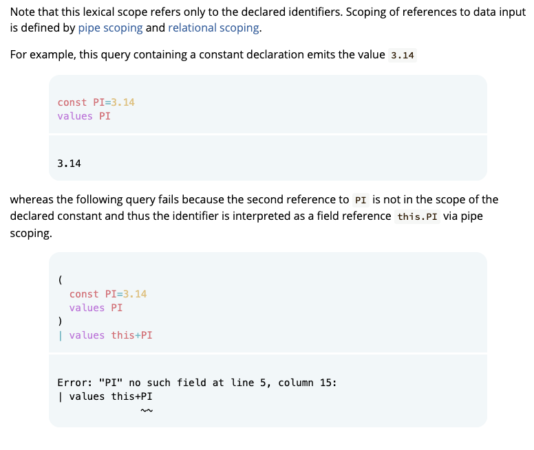

# SuperDB docs

This directory contains the user documentation for all of the SuperDB system.

## Working on docs

You'll need `mdbook`.  Install it with brew
```sh
brew install mdbook
```

The easiest way to work on docs is to run an mdbook service in this directory
and point your browser at its embedded web server, e.g.,
```sh
cd book
make
mdbook serve
```
Then connect to localhost:3000.

To add or remove sections of the book edit `src/SUMMARY.md`.

When editing `SUMMARY.md` it can be useful to kill the mdbook service
and build the book manually like this:
```sh
mdbook build
```
This way the service doesn't do things like recreating a file that you have
removed when you are trying to rearrange things.

After editing any JavaScript or Go files run `make` in this directory.
This will update the Wasm file so playground examples use a version of
SuperDB built from Go source files in the local repository.

## Conventions

The following is an evolving set of style conventions we've adopted when
authoring the current set of docs.

### Fixed width font

The following should be rendered in `fixed width` font:

* Command names (e.g., `super`)
* SuperSQL query text (e.g., `put`, `SELECT`)
* Type names that are language tokens (e.g., `int64`, `VARCHAR`)
* References to operator/function usage (e.g., "the `<expr>` argument to `eval`)"
* Input/output/parameter values (e.g., "the value of N defaults to `1`",
  "`values 1 > 0` produces the literal value `true`")

> **Exceptions**:
> * Don't use fixed width when hyperlinking, since rendered
>   hyperlinks already have color/underline emphasis.
> * Don't use fixed width when describing abstract values, e.g., the "true" in
>   "When the `<predicate>` in a ternary conditional is true..." to avoid
>   incorrectly giving the impression only the literal value `true` is
>   intended.
> * Don't use fixed with for data types that aren't language tokens, e.g.,
>   "record" or "array"

### Hyperlinking names of functions/operators/etc.

* The anchor text should contain _only_ the name of the functions/operators/etc.
* Precede with "SQL" if contrast with pipe context is appropriate
* Hyperlink from only the first reference in a section

```
# ✅ Do this
the [put](put.md) operator performs field assignment
`cut` is much like a SQL [SELECT](select.md) clause
While [`from`](from.md) is often used with files, `from` also works with URLs

# ❌ Not these
the [put operator](put.md) performs field assignment
`cut` is much like a [SELECT clause](select.md)
While [`from`](from) is often used with files, [`from`](from.md) also works with URLs
```

> **Exception**: Hyperlinking to the same place multiple times in the same
  section may sometimes be appropriate, e.g., if you're closing a section by
  once again mentioning there's more examples in some operator's docs,
  hyperlink there too.

### Uppercase

* References to SQL keywords should be in `UPPERCASE`

```
# ✅ Do this
`cut` is much like a SQL [SELECT](select.md) clause

# ❌ Not this
`cut` is much like a SQL [select](select.md) clause
```

### Stacked mdtest-spq for wide examples

Locally check the rendering of mdtest-spq examples and use "stacked" layout
for any that contain long lines which result in a horizontal scrollbar in
default rendering.

````
# ✅ Do this
```mdtest-spq {data-layout="stacked"}
# spq
rename a:=b
# input
{b:1}
{a:1,b:1}
{c:1}
# expected output
{a:1}
error({message:"rename: duplicate field: \"a\"",on:{a:1,b:1}})
{c:1}
```
````

````
# ❌ Not this
```mdtest-spq
# spq
rename a:=b
# input
{b:1}
{a:1,b:1}
{c:1}
# expected output
{a:1}
error({message:"rename: duplicate field: \"a\"",on:{a:1,b:1}})
{c:1}
```
````

Which avoids the effect shown here:


### Use 85% Width for Inlined Playground Examples

To avoid disrupting flow when small playground examples are inlined with text,
style _without_ **Query**/**Input**/**Result** labels and use an 85% width so
there's some left indent and doesn't feel like a new section boundary.

````
```mdtest-spq {data-layout='no-labels'} {style='margin:auto;width:85%'}
````

Which gives a look like:



Default styling with labels and full width are still ok for larger sets of
back-to-back examples such as found at the bottom of pages for Operators,
Functions, etc.


