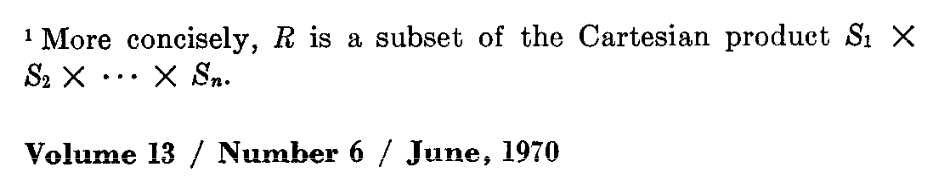

# Introduction

SuperDB is a new type of analytics database that promises an easier approach
to modern data because it unifies relational tables and eclectic JSON in a
powerful, new data model called [_super-structured data_](formats/model.md).
SuperDB's query language is a
[pipe SQL](https://research.google/pubs/sql-has-problems-we-can-fix-them-pipe-syntax-in-sql/)
adapted for super-structured data called [_SuperSQL_](super-sql/intro.md),
which is aspirationally backward-compatible with
[PostgreSQL](https://www.postgresql.org/).

> [!NOTE]
> The SuperDB implementation is open source and available as a
> [GitHub repository](https://github.com/brimdata/super).  Pre-built binaries
> may be [downloaded and installed](getting-started/install.md)
> via customary mechanisms.

Super-structured data is
* _dynamic_ so that data collections can vary by type and are not handcuffed by schemas,
* _strongly typed_ ensuring that the benefits of comprehensive typing
  like static type checking apply to dynamic data, and
* _self-describing_ thus obviating the need to define schemas up front.

SuperDB has taken many of the best ideas of current data systems and adapted them
for super-structured data with the introduction of:

* the super-structured [data model](formats/model.md),
* several super-structured serialization [formats](formats/intro.md),
* a SQL-compatible [query language](super-sql/intro.md) adapted for super-structured data,
* a super-structured [query engine](https://github.com/brimdata/super/tree/main/runtime/vam), and
* a super-structured [database format](database/format.md) compatible with
  cloud object stores.

To achieve high performance for the dynamically typed data that lies at the heart of
super-structured data, SuperDB has devised a novel vectorized runtime
built as a _clean slate_ around [algebraic types](#enter-algebraic-types).
This contrasts with the Frankenstein approach taken by other analytics systems that
[shred variants](https://github.com/apache/parquet-format/blob/master/VariantShredding.md#value-shredding)
into relational columns.

Putting JSON into a relational table &mdash; whether adding a JSON or variant
column to a relational table or performing schema inference that does not
always work &mdash; is like putting a square peg in a round hole.
SuperDB turns this status quo _upside down_ where JSON and
schema-constrained relational tables are simply special cases of
the more general and holistic super-structured data model.

This leads to ergonomics for SuperDB that are far better for the query language
and for managing data end to end because there is not one way for handling
relational data and a different way for managing dynamic data &mdash;
relational tables and eclectic JSON data are treated in a uniform way
from the ground up.  For example, there's no need for a set of Parquet input files
to all be schema-compatible and it's easy to mix and match Parquet with
JSON across queries.

## Super-structured Data

Super-structured data is strongly typed and self describing.
While compatible with relational schemas, SuperDB does not require such schemas
as they can be modeled as [super-structured records](formats/model.md#21-record).

More specifically, a _relational table_ in SuperDB is simply a collection of
uniformly typed records,
whereas a collection of dynamic but strongly-typed
data can model any sequence of JSON values, e.g., observability data,
application events, system logs, and so forth.

Thus, data in SuperDB is
* strongly typed like databases, but
* dynamically typed like JSON.

Self-describing data makes data easier: when transmitting data from one entity
to another, there is no need for the two sides to agree up front what the schemas
must be in order to communicate and land the data.

Likewise, when extracting and
serializing data from a query, there is never any loss of information as the
[super-structured formats](formats/intro.md)
capture all aspects of the strongly-typed data whether in
[human-readable form](formats/sup.md),
[binary row-like form](formats/bsup.md),
or
[columnar-like form](formats/csup.md).

## The `super` Command

SuperDB is implemented as the standalone,
dependency-free [super](command/super.md) command.
`super` is a little like [DuckDB](https://duckdb.org/) and a little like
[jq](https://stedolan.github.io/jq/) but super-structured data ties these
two command styles together with strong typing of dynamic data.

Because `super` has no dependencies, it's easy to get going &mdash;
just [install the binary](getting-started/install.md) and you're off and running.

SuperDB separates compute and storage and is decomposed into
a runtime system that
* runs directly on any data inputs like files, streams, or APIs, or
* manipulates and queries data in a persistent
storage layer &mdash; the
[SuperDB database](database/intro.md) &mdash; that rhymes in design with the emergent
[lakehouse pattern](https://www.cidrdb.org/cidr2021/papers/cidr2021_paper17.pdf)
but is based on super-structured data.

To invoke the SuperDB runtime without a database, just run `super` without
the [db](command/db.md) subcommand and specify an optional query with `-c`:
```sh
super -c "SELECT 'hello, world'"
```
To interact with a SuperDB database, invoke the [db](command/db.md) subcommands
of `super` and/or program against the [database API](database/api.md).

>[!NOTE]
> The persistent database layer is still under development and not yet
> ready for turnkey production use.

## Why Not Relational?

The fashionable argument against a new system like SuperDB is that SQL and the relational
model (RM) are perfectly good solutions that have stood the test of time
so there's no need to replace them.
In fact,
[a recent paper](https://db.cs.cmu.edu/papers/2024/whatgoesaround-sigmodrec2024.pdf)
from legendary database experts
argues that any attempt to supplant SQL or the RM is doomed to fail
because any good ideas that arise from such efforts will simply be incorporated
into SQL and the RM.

Yet, the incorporation of the JSON data model into the
relational model never fails to disappoint.  One must typically choose
between creating columns of a JSON or [variant type](https://github.com/apache/spark/blob/master/common/variant/README.md) that layers in a parallel set of
operators and behaviors that diverge from core SQL semantics, or
rely upon schema inference to convert variant data into relational tables,
which unfortunately does not always work.

To understand the difficulty of schema inference,
consider this simple line of JSON data is in a file called `example.json`:
```json
{"a":[1,"foo"]}
```

>[!NOTE]
> The literal `[1,"foo"]` is a contrived example but it adequately
> represents the challenge of mixed-type JSON values, e.g.,
> an API returning an array of JSON objects with varying shape.

Surprisingly, this simple JSON input causes unpredictable schema inference
across different SQL systems.
ClickHouse converts the JSON number `1` to a string:
```sh
$ clickhouse -q "SELECT * FROM 'example.json'"
['1','foo']
```
DuckDB does only partial schema inference and leaves the contents
of the array as type JSON:
```sh
$ duckdb -c "SELECT * FROM 'example.json'"
┌──────────────┐
│      a       │
│    json[]    │
├──────────────┤
│ [1, '"foo"'] │
└──────────────┘
```
And DataFusion fails with an error:
```sh
$ datafusion-cli -c "SELECT * FROM 'example.json'"
DataFusion CLI v46.0.1
Error: Arrow error: Json error: whilst decoding field 'a': expected string got 1
```
It turns out there's no easy way to represent this straightforward
literal array value `[1,'foo']` in these SQLs, e.g., simply including this
value in a SQL expression results in errors:
```sh
$ clickhouse -q "SELECT [1,'foo']"
Code: 386. DB::Exception: There is no supertype for types UInt8, String because some of them are String/FixedString/Enum and some of them are not. (NO_COMMON_TYPE)

$ duckdb -c "SELECT [1,'foo']"
Conversion Error:
Could not convert string 'foo' to INT32

LINE 1: SELECT [1,'foo']
                  ^

$ datafusion-cli -c "SELECT [1,'foo']"
DataFusion CLI v46.0.1
Error: Arrow error: Cast error: Cannot cast string 'foo' to value of Int64 type
```

The more recent innovation of an open variant type
is more general than JSON but suffers from similar problems.
In both these cases, the JSON type and the variant
type are not individual types but rather entire type systems that differ
from the base relational type system and so are shoehorned into the relational model
as a parallel type system masquerading as a specialized type to make it all work.

Maybe there is a better way?

## Enter Algebraic Types

What's missing here is an easy and native way to represent mixed-type entities.
In modern programming languages, such entities are enabled with a
[sum type or tagged union](https://en.wikipedia.org/wiki/Tagged_union).

While the original conception of the relational data model anticipated
"product types" &mdash; in fact, describing a relation's schema in terms of
a product type &mdash; it unfortunately did not anticipate sum types.

>[!NOTE]
> Codd's original paper on the relational model has a footnote that
> essentially describes as a product type:
>
> <!-- markdownlint-disable-next-line MD033 -->
> <center></center>
>
> But sum types were notably absent.

Armed with both sum and product types, super-structured data provides a
comprehensive algebraic type system that can represent any
[JSON value as a concrete type](https://www.researchgate.net/publication/221325979_Union_Types_for_Semistructured_Data).
And since relations are simply product types
as originally envisioned by Codd, any relational table can be represented
also as a super-structured product type.  Thus, JSON and relational tables
are cleanly unified with an algebraic type system.

In this way, SuperDB "just works" when it comes to processing the JSON example
from above:
```sh
$ super -c "SELECT * FROM 'example.json'"
{a:[1,"foo"]}
$ super -c "SELECT [1,'foo'] AS a"
{a:[1,"foo"]}
```
In fact, we can see algebraic types at work here if we interrogate the type of
such an expression:
```sh
$ super -c "SELECT typeof(a) as type FROM (SELECT [1,'foo'] AS a)"
{type:<[int64|string]>}
```
In this super-structured representation, the `type` field is a first-class
[type value](super-sql/types/type.md)
representing an array type of elements having a sum type of `int64` and `string`.

## SuperSQL

Since super-structured data is a superset of the relational model, it turns out that
a query language for super-structured data can be devised that is a superset of SQL.
The SuperDB query language is a
[Pipe SQL](https://research.google/pubs/sql-has-problems-we-can-fix-them-pipe-syntax-in-sql/)
adapted for super-structured data called
[_SuperSQL_](super-sql/intro.md).

SuperSQL is particularly well suited for data-wrangling use cases like
ETL and data exploration and discovery.
[Syntactic shortcuts](super-sql/operators/intro.md#shortcuts),
[keyword search](super-sql/operators/search.md), and the
[pipe syntax](super-sql/intro.md#pipe-queries)
make interactively querying data a breeze.  And language features like
[recursive functions](super-sql/expressions/subqueries.md#recursive-subqueries)
with re-entrant subqueries allow for traversing nested data
in a general and powerful fashion.

Instead of operating upon statically typed relational tables as SQL does,
SuperSQL operates upon super-structured data.
When such data happens to look like a table, then SuperSQL can work just
like SQL:
```sh
$ super -c "
SELECT a+b AS x, a-b AS y FROM (
  VALUES (1,2),	(3,0)
) AS T(a,b)
"
{x:3,y:-1}
{x:3,y:3}
```
But when data does not conform to the relational model, SuperSQL can
still handle it with its super-structured runtime:
```sh
$ super -c "
SELECT avg(radius) as R, avg(width) as W FROM (
  VALUES
    {kind:'circle',radius:1.5},
    {kind:'rect',width:2.0,height:1.0},
    {kind:'circle',radius:2},
    {kind:'rect',width:1.0,height:3.5}
)
"
{R:1.75,W:1.5}
```

Things get more interesting when you want to do different kinds of processing
for differently typed entities, e.g., let's compute an average radius of circles,
and double the width of each rectangle.  This time we'll use the pipe syntax
with shortcuts and employ first-class errors to flag unknown types:
```sh
$ super -c "
values
  {kind:'circle',radius:1.5},
  {kind:'rect',width:2.0,height:1.0},
  {kind:'circle',radius:2},
  {kind:'rect',width:1.0,height:3.5},
  {kind:'triangle',base:2.0,height:3.0}
| switch kind
    case 'circle' (
        R:=avg(radius)
    )
    case 'rect' (
        width:=width*2
    )
    default (
        error({message:'unknown shape',value:this})
    )
"
{R:1.75}
{kind:"rect",width:4.,height:1.}
{kind:"rect",width:2.,height:3.5}
error({message:"unknown shape",value:{kind:"triangle",base:2.,height:3.}})
```

So what's going on here?  The data model here is acting both
as a strongly typed representation of JSON-like sequences as well as a
means to represent relational tables.  And SuperSQL is behaving like SQL
when applied to table-like data, but at the same time is a
pipe-syntax language for arbitrarily typed data.
The super-structured data model ties it all together.

To make this all work, the runtime must handle arbitrarily typed data.  Hence, every
operator in SuperSQL has defined behavior for every possible input type.
This is the key point of departure for super-structured data: instead of the unit of processing being a relational table, which requires a statically defined schema, the unit of processing is a collection of arbitrarily typed values.
In a sense, SuperDB generalizes Codd's relational algebra to polymorphic operators.
All of Codd's relational operators can be recast in this fashion forming
the polymorphic algebra of super-structured data implemented by SuperDB.

## Evolving SQL

Despite SQL's enduring success,
it is widely accepted that there are serious flaws in the language and
a number of authors argue that SQL should be replaced in its entirety.
Among many such works, here are some noteworthy arguments:

* [A Critique of the SQL Database Language](https://dl.acm.org/doi/pdf/10.1145/984549.984551)
a 1983 paper by
[C.J. Date](https://en.wikipedia.org/wiki/Christopher_J._Date),
* [Against SQL](https://www.scattered-thoughts.net/writing/against-sql/)
by [Jamie Brandon](https://www.scattered-thoughts.net/),
* [A Critique of Modern SQL And A Proposal Towards A Simple and Expressive
Query Language](https://www.cidrdb.org/cidr2024/papers/p48-neumann.pdf)
by [Neumann](https://db.in.tum.de/~neumann/)
and [Leis](https://www.cs.cit.tum.de/dis/team/prof-dr-viktor-leis/).

A very different approach is taken in
[SQL Has Problems. We Can Fix Them: Pipe Syntax In SQL](https://research.google/pubs/sql-has-problems-we-can-fix-them-pipe-syntax-in-sql/), which argues that SQL
should be merely improved upon and not replaced outright.
Here the authors argue that except for compositional syntax, SQL is
perfectly reasonable and we should live with its anachronisms (see Section 2.4).
Thus, their
[Pipe SQL specification](https://github.com/google/zetasql/blob/master/docs/pipe-syntax.md)
carries forward SQL eccentricities into their modern adaptation
of pipes for SQL.

SuperSQL takes a different approach and seizes the opportunity to modernize
the ergonomics of a SQL-compatible query language.
While embracing backward compatibility,
SuperSQL diverges significantly from SQL anachronisms in the pipe portion of
the language by introducing
[pipe scoping](super-sql/intro.md#pipe-scoping) semantics
that coexist next to the
[relational scoping](super-sql/intro.md#relational-scoping) semantics
of SQL tables and columns.

The vision here is that comprehensive backward
compatibility can reside in the SQL operators while a modernized syntax and
and improved ergonomics can reside in the pipe operators, e.g.,

* array indexing [can be configured](super-sql/declarations/pragmas.md)
  as 1-based in SQL clauses but 0-based in pipe operators,
* column names in SQL clauses are case insensitive while record field references
are case sensitive in pipe operators,
* complex scoping rules for table aliases and column references are required in
relational SQL while binding from names to data in pipe operators is managed
in a uniform and simple way as derefenced paths on [this](super-sql/intro.md#pipe-scoping),
* the syntactic structure of SQL clauses means all data must conform to a table
whereas pipe operators can emit any data type desired in a varying fashion, and
* [sum types](super-sql/types/union.md) are integral to piped data allowing mix-typed data processing
and results that need not fit in a uniform table.

With this approach, SuperSQL can be adopted and used for existing use cases
based on legacy SQL while incrementally expanding and embracing
the pipe model tied to super-structured data.
Perhaps this could enable a long-term and gradual transition away
from relational SQL toward a modern and more ergonomic replacement.

The jury is out as to whether a Pipe SQL for super-structured data is the
right approach for curing SQL's ills, but it certainly provides a framework
for exploring entirely new language abstractions while maintaining complete
backward compatibility with SQL all in the same query language.

> [!NOTE]
> If SuperDB or super-structured data has piqued your interest,
> you can dive deeper by:
> * exploring the [SuperSQL](super-sql/intro.md) query language,
> * learning about the
> [super-structured data model](formats/model.md) and
  [formats](formats/intro.md) underlying SuperDB, or
> * browsing the [tutorials](tutorials/intro.md).
>
> We'd love your feedback and we hope to build a thriving community around
> SuperDB so please feel free to reach out to us via
> * [Slack](https://www.brimdata.io/join-slack/)
> * [GitHub issues](https://github.com/brimdata/super/issues), or
> * [GitHub pull requests](https://github.com/brimdata/super/pulls).
>
> See you online!
